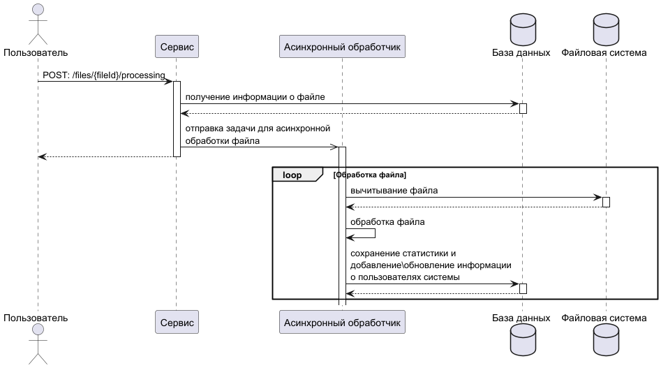

# CSV User Importer Service (это было задание на интенсиве от SHIFT)

Веб-сервис на Spring Boot, предназначенный для автоматической обработки, парсинга и сохранения данных пользователей из CSV-файлов в базу данных PostgreSQL.

## Схема работы бэкенда

## Технологический стек

* Java 17
* Framework: Spring Boot 3.x (Spring Web, Spring Data JPA)
* Database: PostgreSQL
* ORM: Hibernate
* Database Management: pgAdmin 4
* Containerization: Docker
* Build Tool: Gradle

## Основные возможности

* Парсинг CSV: Чтение и обработка структуры CSV-файлов с проверкой типов данных и кодировок (UTF-8).
* Автоматическое окружение: Автоматический запуск контейнеров PostgreSQL и pgAdmin при старте приложения через docker-compose.yml.
* Сохранение данных: Валидация и запись сущностей в БД с использованием JPA/Hibernate.
