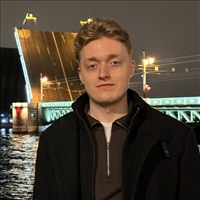
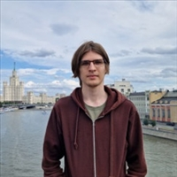
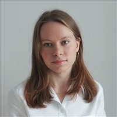
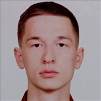

# 👨‍🏫 Кураторы курса по Java

Добро пожаловать! Ниже представлен список кураторов, которые помогут вам пройти курс по Java. Вы можете обращаться к ним за поддержкой по учебным материалам, заданиям и техническим вопросам.

---

## 📋 Список кураторов

### 👤 Максименков Максим

- **Фото:**  
  

---

### 👤 Мокровицкий Максим

- **Фото:**  
  

---

### 👤 Головин Денис

- **Фото:**  
  

---

### 👤 Кононенко Рустам

- **Фото:**  
  

---

### 👤 Нетёсов Владислав

- **Фото:**  
  

---

### 👤 Терентьева Алёна

- **Фото:**  
  

---

### 👤 Семёнов Семён

- **Фото:**  
  

---
